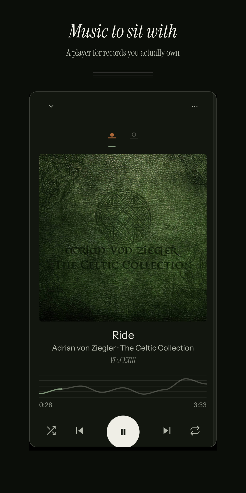
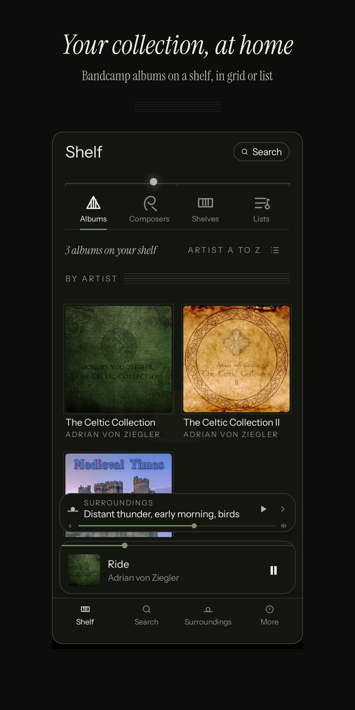
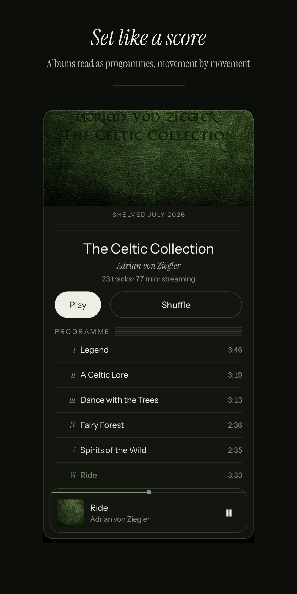
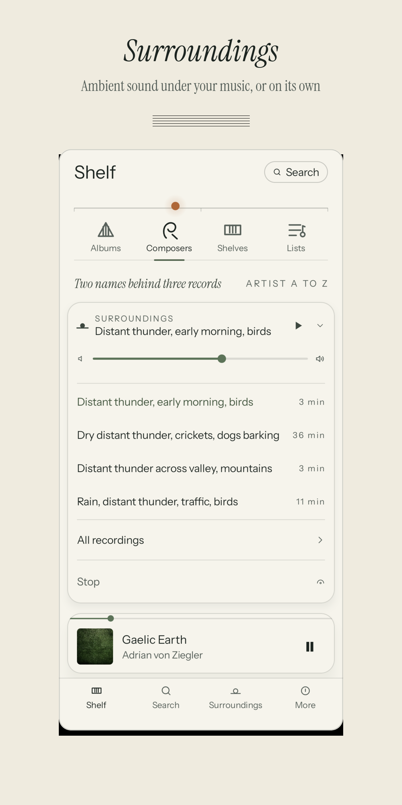
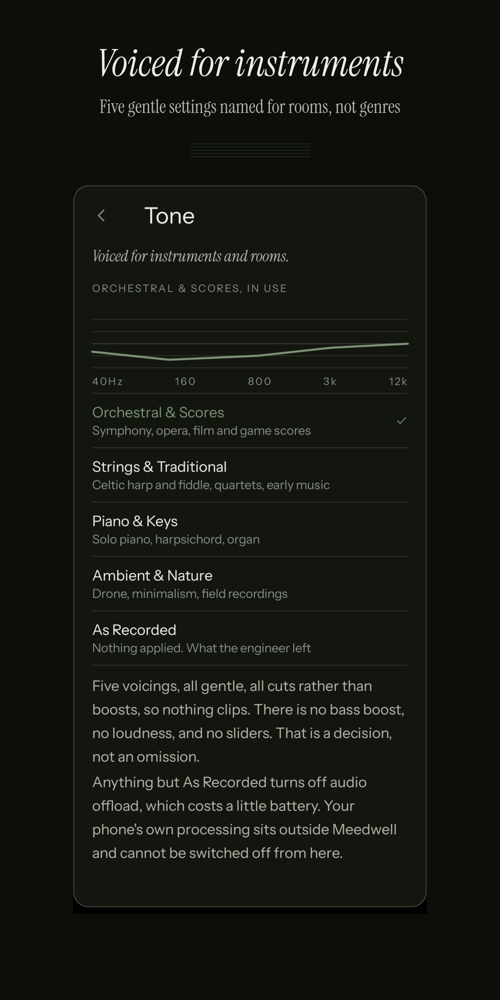
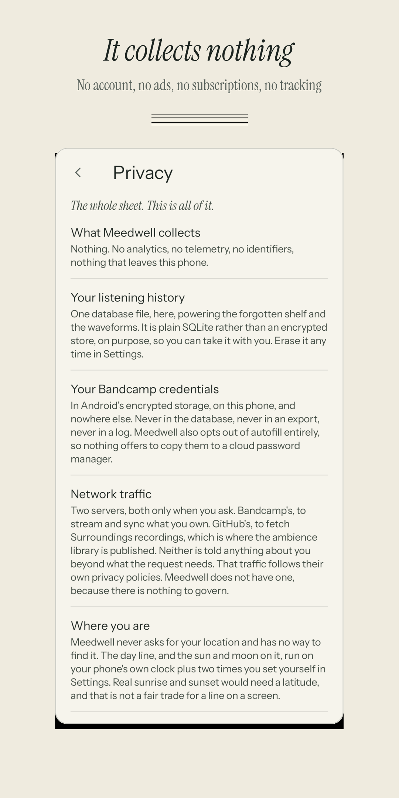

# Meedwell

**For people who buy their music.**

An Android player for the music you actually own. Your Bandcamp collection and
the audio files already on your phone, on one shelf: streamed when you are out,
played from your own files when you have them.

Anyone can be at home here. Meedwell was designed from the ground up for one
kind of listener, though: the one who puts on a chamber piece, a film score,
solo piano, Celtic strings or an hour of ambience and actually sits with it.
The whole app is drawn like a printed score, down to the Roman numerals on an
album's movements.

Free, forever, with nothing held back and nothing unlocked later. It collects
nothing about you. Not analytics, not telemetry, not an identifier, not a crash
report you did not send.

---

## Getting it

Coming to Google Play as **Meedwell: Bandcamp Player**. The package name is
`io.github.kamsiob.meedwell`.

You need a Bandcamp account only if you want your Bandcamp collection on the
shelf: the listening credentials come from your fan settings, under Subsonic.
Local files and the whole Surroundings library work with no account at all.

---

## What it looks like

Real captures from the running app, both themes. Nothing here is a mockup.

| | | |
|---|---|---|
|  |  |  |
| **The player.** The scrubber is the piece's own loudness curve, drawn on a five line staff. | **The shelf.** Albums, Composers, Shelves and Lists, as a cover grid or a compact list. | **An album.** Set as a programme rather than a track list. |
|  |  |  |
| **Surroundings.** Ambient sound under your music, or on its own. | **Tone.** Five gentle voicings, named for instruments and rooms rather than genres. | **Privacy.** The whole sheet, in the app, in plain words. |

---

## What it does

**One shelf.** Your Bandcamp collection and any folder of music on your phone,
merged into a single library. A record you bought and a record you already had
sit next to each other, and if you own both the local file is the one that
plays.

**It plays your files, not copies of them.** Point Meedwell at a folder and the
music there joins the shelf as what it is: plain files, readable by any player,
which outlive this app. Nothing is imported into a private store.

**The forgotten shelf.** Records you bought, meant to listen to, and did not.
Worked out on your phone from your own play log: never played, played once or
twice, or quiet for fourteen months. No algorithm, no feed, nothing sent
anywhere.

**Surroundings.** A field recording playing under the music: rain on leaves, a
fireplace, a rainforest at night, a train. One hundred and eleven of them,
three shipped inside the app and the rest available to download. They loop with
a two and a half second crossfade, so they run for hours without the loop point
ever announcing itself.

**Your data is yours.** One plain SQLite file, deliberately not encrypted, so a
future desktop or web build can read it. Export everything to a file you keep,
restore it anywhere, erase your listening history whenever you like.

---

## What it does not do

This section is not marketing. These are real limits, and most of them come from
what Bandcamp's Subsonic API actually supports, verified against a live account
rather than assumed from documentation.

- **It cannot download your music from Bandcamp.** Their API streams your
  collection but does not hand over the files. Download them the way you always
  have, point Meedwell at the folder, and they join the shelf as files you own.
- **It cannot remove a heart.** Adding one works and reaches your Bandcamp
  account. Removing one is broken on Bandcamp's side and returns an error
  whatever is sent. The app says so where it matters rather than failing
  silently.
- **Your lists live on this phone.** You can make them, name them, reorder them
  and delete them, and any playlist your Bandcamp account already has appears
  alongside them. What cannot happen is syncing: Bandcamp's API has no way for
  an app to create or change a playlist, so a list made here stays here, and the
  app says so rather than implying it reached your account.
- **Streams are MP3.** That is what the API serves. Your own files play at
  whatever quality they are, and the app never implies otherwise.
- **Bandcamp's Subsonic support is a young beta.** Eleven endpoints a normal
  Subsonic client would use do not exist. Meedwell works around all of them and
  says plainly when something fails.

---

## Privacy

Nothing about you leaves your phone, and there is no account with Kamsiob to
make.

Meedwell talks to exactly two servers, and only when you ask it to: Bandcamp's,
to sync and stream what you own, and GitHub's, to fetch Surroundings recordings.
Your Bandcamp credentials live in Android's encrypted storage, are never written
to the database, never included in an export, and never logged.

There is no privacy policy because there is nothing to govern. The full
explanation is on the Privacy screen in the app, and every claim on it can be
checked by reading this source.

---

## Building it

Requires **JDK 21** and an Android SDK with API 37.

```
export JAVA_HOME=/path/to/jdk-21
./gradlew :app:assembleDebug
```

Two modules. `:core` is pure Kotlin with no Android dependencies and holds the
decisions worth proving: the Subsonic parsing, the local file matching, the
crossfade and limiter arithmetic, the export format. `:app` is everything that
needs a phone.

165 tests across 13 files, all in `:core` where they can run in a second without
a device.

```
./gradlew :core:test :app:testDebugUnitTest
```

Note that `org.jetbrains.kotlin.android` is deliberately **not** applied.
AGP 9 brings its own Kotlin support and applying it fails the build.

---

## License

**AGPL-3.0-or-later.** See [LICENSE](LICENSE).

The Surroundings recordings are **not** covered by that license. They are the
work of the people who recorded them, released under CC0 and Creative Commons
Attribution, and are published separately at
[meedwell-surroundings](https://github.com/Kamsiob/meedwell-surroundings) with
every recordist, license and modification recorded per file. Every credit shown
in the app is generated from that data rather than typed, so it cannot drift.

---

## Support

Meedwell is free whether or not you ever give anyone anything. One person
carries it. If you want to support the work there is a quiet button in Settings,
and if you would rather spend the money on a record instead, that is a better
outcome and the app will never suggest otherwise.
